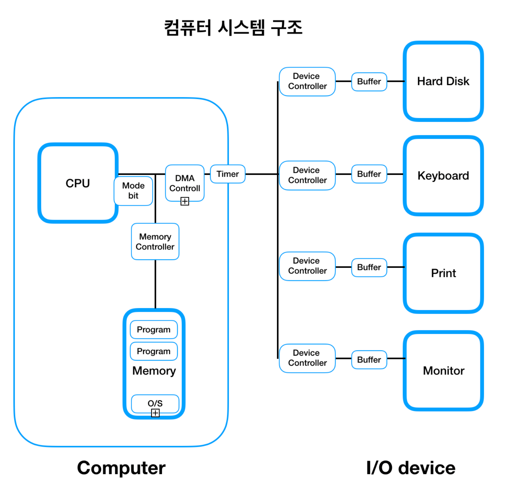

# 

**CPU**

- 구성
    - ALU(산술논리 장치)
    - CU(컨트롤 장치)
    - Register(레지스터)
- 주요 기능
    - 명령어를 실행하기 위해 데이터를 가져오고(fetch) 명령어를 해석하고(decode), 실행(execute)

**Memory (주 기억장치)**

- ROM, RAM
---

**Mode bit**

CPU에서 실행되는 것이 OS인지 사용자 프로그램인지 구분해주는 역할

- 1 사용자 모드: 사용자 프로그램 수행
- 0 모니터 모드: OS 코드 수행

**Timer**

정해진 시간 흐른 뒤 운영체제에게 제어권이 넘어가도록 인터럽트 발생시킨다.

- CPU를 특정 프로그램이 독점하는 것 방지

**Device Controller**

- 해당 I/O device을 관리하는 일종의 작은 CPU
- Devide Controller는 I/O가 끝났을 경우 인터럽트로 CPU에 알린다.

**Local Buffer**

Device Controller로부터 들어오고 나가는 데이터를 임시로 저장하기 위한 작은 메모리 공간

**DMA Controller**

디바이스 작업 완료 후, local buffer의 내용을 직접 memory로 복사후 CPU에 인터럽트

**DMA(Direct Memory Access)**

CPU가 각각의 I/O디바이스를 통해 데이터를 읽어 메모리에 저장하는 것은 CPU 효율 떨어지기 때문에, 주변 기기 인터페이스 장치에 제어권을 주어 직접 메모리에 데이터를 주고 받는 방식으로 엑세스하여 데이터를 전송하는 방법

**운영체제란?**

- 응용 프로그램과 하드웨어 사이 인터페이스 역할을 하며 시스템 동작을 제어하는 시스템 소프트웨어
- 즉, 시스템의 자원과 동작을 관리하는 소프트웨어
    - 프로세스 관리
    - 저장장치 관리
    - 네트워킹
    - 사용자 관리
    - 디바이스 드라이버

**프로그램 실행 흐름**

1. **전원을 키면 메모리에 운영체제가 올라간다.**
    1. 운영체제 코드 전부 올라가는 것은 아니고, 커널 코드만 올라간다.
    2. 최소 시스템 실행을 목적

2. **CPU는 운영체제 실행**

3. **사용자 프로그램 실행**
    1. 메모리에 프로그램 올라간다.
    2. CPU는 메모리의 명령어 주소를 레지스터에 저장(PC 레지스터)
    3. 이 후 각 프로그램들은 I/O 디바이스 사용이 필요할 수 있는데 이러한 요청은 운영체제에 요청
    4. 이러한 요청을 시스템 콜
    5. 프로그램들이 직접 I/O 디바이스 제어하지 않는 이유는? 가장 큰 이유= 보안

4. **프로그램의 요청 받은 운영체제는 I/O Device Controller에게 데이터 입출력 처리 요청**
    1. 컨트롤러는 입출력 받기 되면 인터럽트 발생시켜 CPU에게 작업 완료 알리게 된다.
    2. CPU는 버퍼에 가서 데이터를 읽어와 메모리에 올린다(DMA Controller가 수행)
---
**CPU와 I/O 연산**

- 컴퓨터 연산은 CPU가 처리
- I/O 디바이스 연산은 각각의 디바이스 컨트롤러가 처리
- 디바이스 컨트롤러= 디바이스의 CPU 역할
- 따라서, 컴퓨터 연산 I/O 연산 동시에 처리 가능하다.

**Memory와 Local Buffer**

- 디바이스 컨트롤러로부터 들어오고 나오는 데이터들은 로컬 버퍼에서 관리한다.
- 로컬 버퍼는 메모리와 같은 역할
- 데이터가 입출력은 CPU가 처리하는게 아니라,
- 각 디바이스 컨트롤러들이 연산을 하고 CPU에게 인터럽트 발생시켜 보고
- CPU는 항상 메모리에 명령어를 읽어와 작업을 수행하는데,
- 명령어를 읽어오기 전에 인터럽트 발생했는지 확인
- 인터럽트가 발생했으면 인터럽트를 먼저 처리하고 그 이후에 명령어 처리한다.